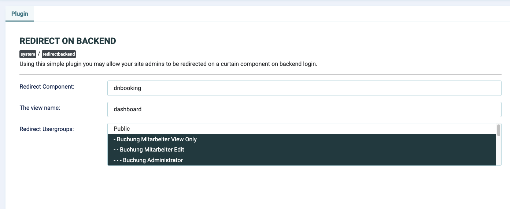

# Joomla 4 / 5 Ready Version: Redirect On Backend Login from Extensions Directory

Because I needed the plugin for a project and couldn't find another one quickly, I grabbed Redirect On Backend Plugin from the Joomla Extensions and made it ready for Joomla 4 / 5.

Here is the link to the original:

https://extensions.joomla.org/extension/system-redirect-on-backend-login/

I have tested it with Joomla 4 and 5 and it works fine.

## Usage

Install and activate the plugin. Then go to the plugin settings and enter the component and the view to which you want to redirect to after login.

See screen for settings

